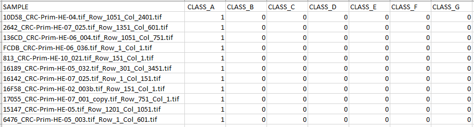

## Default Dataset Setup

The AUCMEDI AutoML expects a fixed dataset structure if run on default parameters.

A custom named data directory (in this example `aucmedi.data`) holds the two required
image directories: `training` for the training process and `test` for the prediction process.

```bash
aucmedi.data/
├── training/                     # Required for training
│   ├── class_a/
│   │   ├── img_x.png
│   │   └── ...
│   ├── class_b/                  # Subdirectory for each class
│   │   ├── img_y.png
│   │   └── ...
│   ├── class_c/
│   │   ├── img_z.png             # Image names have to be unique
│   │   └── ...                   # between subdirectories
│   └── ...
├── test/                         # Required for prediction
│   ├── unknown_img_n.png
│   └── ...
├── model/                        # Will be created by training
├── xai/                          # Will be created by prediction (optional)
├── evaluation/                   # Will be created by evaluation
└── preds.csv                     # Will be created by prediction
```

The dataset structure is by default in the working directory for CLI or
is mounted as volume into the container for Docker.

## Dataset I/O Parameters

The dataset structure can be customized with the following parameters:

| AutoML Mode | I/O | Parameter | Default |
|:------------|:----|:----------|--------:|
| Training | Input | `path_imagedir` | 'training' |
| Training | Output | `path_modeldir` | 'model' |
| Prediction | Input | `path_imagedir` | 'test' |
| Prediction | Input | `path_modeldir` | 'model' |
| Prediction | Output | `path_pred` | 'preds.csv' |
| Prediction | Output | `xai_directory` | 'xai' |
| Evaluation | Input | `path_imagedir` | 'training' |
| Evaluation | Input | `path_pred` | 'preds.csv' |
| Evaluation | Output | `path_evaldir` | 'evaluation' |


## CSV Dataset (multi-label)

Instead of utilizing the directory interface for passing the training data
class annotations via subdirectories, it is also possible to pass them as CSV.

This is required for setup a multi-label classification pipeline.

The default dataset structure then would look like this:

```bash
aucmedi.data/
├── training/                     # Required for training
│   ├── img_x.png
│   ├── img_y.png                 # Single directory with all training images
│   ├── img_z.png
│   └── ...
├── test/                         # Required for prediction
│    ├── unknown_img_a.png
│    ├── unknown_img_b.png
│    └── ...
└── annotations.csv               # CSV annotations for training
```

The CLI command for multi-label CSV data would then look like this:

```sh
aucmedi training --path_gt annotations.csv --ohe
```

???+ info "One-hot encoded CSV Example"
    

More information for CSV files can be found here:
[IO_CSV Interface][aucmedi.data_processing.io_interfaces.io_csv]
