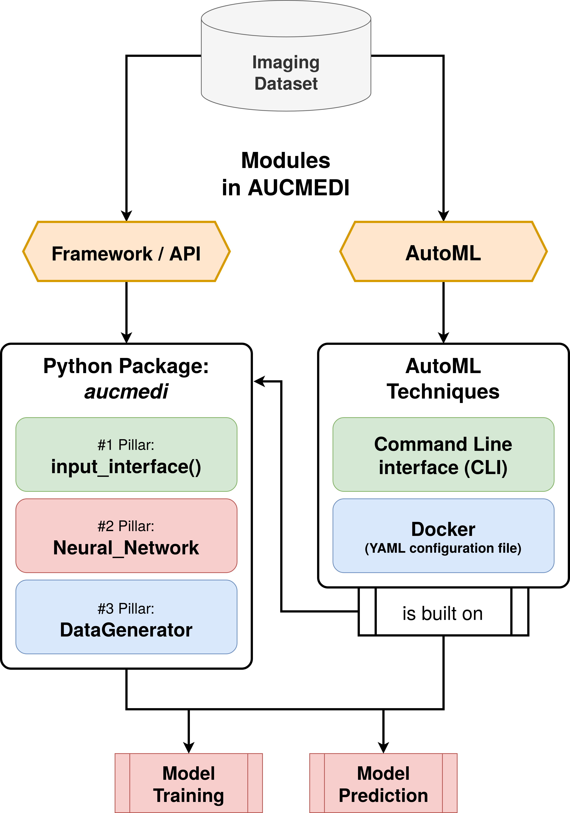

# Work in Progress!

The software package AUCMEDI not only offers a **library as a high-level API** for the standardized construction of modern medical image classification pipelines, but also reproducible installation and **direct application via CLI or Docker**.

With AUCMEDI, researchers are able to set up a complete and easy-to-integrate pipeline for medical image classification with just a few lines of code.

!!! info "AUCMEDI Modules"
    | Module                     | Description                                                    |
    | -------------------------- | ----------------------------------------------------------------- |
    | Framework / API for Python | The framework or API for building medical image classification pipelines in Python. Can be installed via PyPI (pip ) and used in scripts or Jupyter Notebooks. |
    | AutoML via CLI             | The AutoML module via CLI for fast application. Can be used in a command language fashion (like Unix Shell in Linux) for straightforward integration in IT environments. |
    | AutoML via Docker          | The AutoML module via Docker for robust application. Allow secure and stable integration in critical IT environments (like clinical environments). |

With the two modules, AUCMEDI combines straightforward and fast setup via AutoML with the option of detailed customization via the framework/API as toolbox.

*Flowchart diagram of the AUCMEDI modules showing the Framework/API and the AutoML module.*
