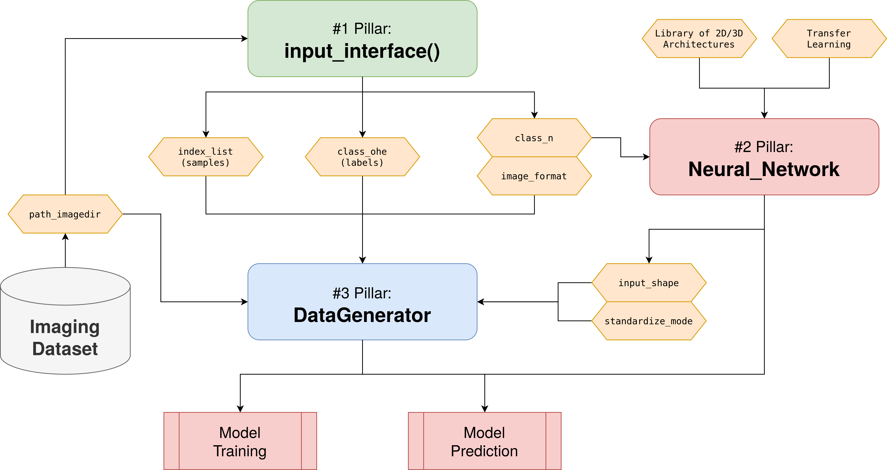

## Pillar Structure

AUCMEDI is based on 3 pillars which allow building any state-of-the-art medical image classification pipeline.

!!! info "Pillars of AUCMEDI"
    | Pillar                                                                    | Type     | Description                                                       |
    | ------------------------------------------------------------------------- | -------- | ----------------------------------------------------------------- |
    | #1: [input_interface()][aucmedi.data_processing.io_data.input_interface]  | Function | Obtaining general information from the dataset.                   |
    | #2: [NeuralNetwork][aucmedi.neural_network.model.NeuralNetwork]         | Class    | Building the deep learning model.                                 | 
    | #3: [DataGenerator][aucmedi.data_processing.data_generator.DataGenerator] | Class    | Powerful interface for loading any images/volumes into the model. |

The different pillars are represented in Python as function and classes.
The passed parameters allow configuration of the automatically created image classification pipeline.
The pillar interface of AUCMEDI combines intuitive and straightforward setup with the possibility
of detailed custom specification.


*Flowchart diagram of the AUCMEDI pipeline showing the three pillars acting as access points: input_interface() for extracting relevant dataset information, NeuralNetwork for building the deep learning model and DataGenerator for data loading as well as preprocessing.*

## Basic Usage

Simply install AUCMEDI with a single line of code via pip.

**Install AUCMEDI via PyPI**
```sh
pip install aucmedi
```

Let's build a COVID-19 Detection AI on CT scans!

**Build a pipeline**
```python
# AUCMEDI library
from aucmedi import *

# Pillar #1: Initialize input data reader
ds = input_interface(interface="csv",
                     path_imagedir="/home/muellerdo/COVdataset/ct_scans/",
                     path_data="/home/muellerdo/COVdataset/classes.csv",
                     ohe=False,           # OHE short for one-hot encoding
                     col_sample="ID", col_class="PCRpositive")
(index_list, class_ohe, nclasses, class_names, image_format) = ds

# Pillar #2: Initialize a DenseNet121 model with ImageNet weights
model = NeuralNetwork(n_labels=nclasses, channels=3,
                       architecture="2D.DenseNet121",
                       pretrained_weights=True)
```
Congratulations to your ready-to-use Medical Image Classification pipeline including data I/O, preprocessing and a deep learning based neural network model.

**Train a model and use it!**
```python
# Pillar #3: Initialize training Data Generator for first 1000 samples
train_gen = DataGenerator(samples=index_list[:1000],
                          path_imagedir="/home/muellerdo/COVdataset/ct_scans/",
                          labels=class_ohe[:1000],
                          image_format=image_format)
# Run model training with Transfer Learning
model.train(train_gen, epochs=20, transfer_learning=True)

# Pillar #3: Initialize testing Data Generator for 500 samples
test_gen = DataGenerator(samples=index_list[1000:1500],
                         path_imagedir="/home/muellerdo/COVdataset/ct_scans/",
                         labels=None,
                         image_format=image_format)
# Run model inference for unknown samples
preds = model.predict(test_gen)

# preds <-> NumPy array with shape (500,2)
# -> 500 predictions with softmax probabilities for our 2 classes
```
