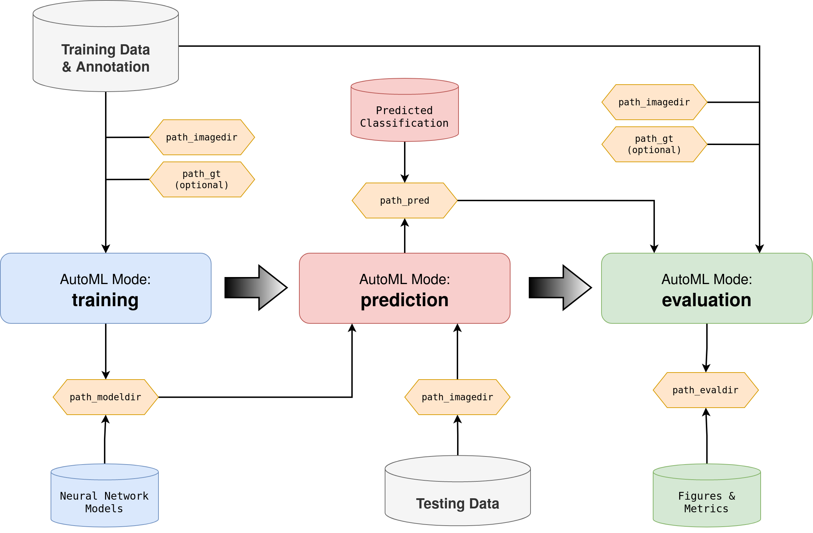

# work in progress

## AutoML Types

blabla docker and CLI.

!!! info "Pillars of AUCMEDI"
    | Pillar                                                                    | Type     | Description                                                       |
    | ------------------------------------------------------------------------- | -------- | ----------------------------------------------------------------- |
    | #1: [input_interface()][aucmedi.data_processing.io_data.input_interface]  | Function | Obtaining general information from the dataset.                   |
    | #2: [NeuralNetwork][aucmedi.neural_network.model.NeuralNetwork]         | Class    | Building the deep learning model.                                 |
    | #3: [DataGenerator][aucmedi.data_processing.data_generator.DataGenerator] | Class    | Powerful interface for loading any images/volumes into the model. |

blabla.


*Flowchart diagram of AUCMEDI AutoML showing the pipeline workflow and three AutoML modes: training for model fitting, prediction for inference of unknown images, and evaluation for performance estimation.*

## Dataset Setup

```bash
working_dir/
├── training/                     # Required for training
│   ├── class_a/
│   │   ├── img_x.png
│   │   └── ...
│   ├── class_b/                  # Subdirectory for each class
│   │   ├── img_y.png
│   │   └── ...
│   ├── class_c/
│   │   ├── img_z.png             # Image names have to be unique
│   │   └── ...                   # between subdirectories
│   └── ...
├── test/                         # Required for prediction
│   ├── unknown_img_n.png
│   └── ...
├── model/                        # Will be created by training
├── evaluation/                   # Will be created by evaluation
└── preds.csv                     # Will be created by prediction
```

## Basic Usage - CLI

## Basic Usage - Docker
